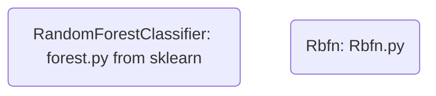

# Classifier for SMIDA
[List of Documentation Files](menu.md)

[TOC]

## Overview

They are selected in *evaluation.py* by `-- clf`

-  `rf`: Random Forrest
-  `rbfn`: Radial Basic Function Networks

## Details

They are loaded in `base_selection.py`
Verify the defaults there, things in this documentation can be outdated!

### Random Forrest

See documentation of [RandomForestClassifier](https://scikit-learn.org/stable/modules/generated/sklearn.ensemble.RandomForestClassifier.html)

Our implementation takes the following parameters by default

- n_estimators = 200 (rf_n_estimators)
- n_jobs = -1

Following Parameters are optional (If there is max_depth, min_samples_split, and min_samples_split)

- max_features
- max_depth
- bootstrap=True
- min_samples_leaf
- min_samples_split

### Radial Basic Function Networks

Default Parameter

- random_state=42
- n_clusters=32 (rbfn_k)
