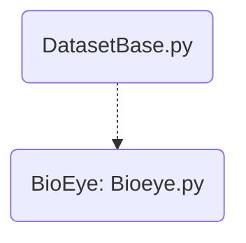

# DATASETS in SMIDA
[List of Documentation Files](menu.md)

get_dataset (evaluation.py) will load different datasets by classes from folder datasets.

[TOC]

## Known Datasets

There are different conversion functions and tools to prepare the data.

### BioEye

References for the data

1. `DBLP:journals/prl/GeorgeR16` The date is mentioned with reference to the Homepage. See 4.
2. `DBLP:journals/ivc/RigasK17` A lot of data is mentioned, but not described.
3. `DBLP:conf/btas/KomogortsevR15` This has actual the best description, but is cited by `DBLP:journals/ivc/RigasK17`.
4. The data were available at https://bioeye.cs.txstate.edu/database.php, but is not anymore.

## Code

Looking for coordinates? [Trajectory](Trajectory.md) could be interesting.

### Parent: DatasetBase

Brings the basic commands to deal with datasets.

| Command | Purpose |
| ------------- | ----------- |
| get_screen_params | pix_per_mm, screen_dist_mm, screen_res |
| get_users | list of user IDs |
| get_cases | list of different experiments (multiple cases per user) |
| load_data(user,case) | loading x and y coordinates for each user from the raw data |
| load_data_no_nan | see load_data |
| get_stimulus | path to stimulus |
| *load_training()* | return x (sampels) and y (user id) for training |
| *load_testing()* | return x (sampels) and y (user id) for testing |

Italic styled commands are from child classes, but i think they should be mentioned here.

### Childs

These classes specify the use for different data types (see above).
They bring different information regarding to the data.